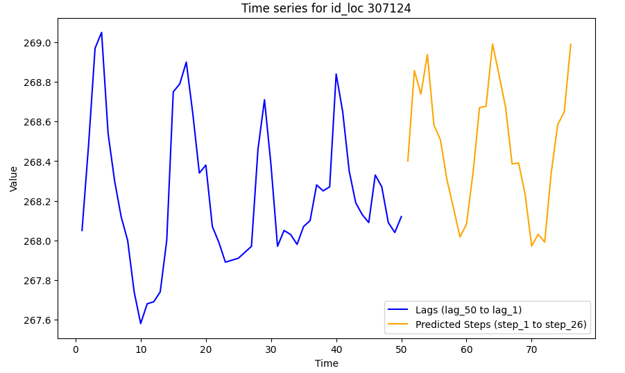
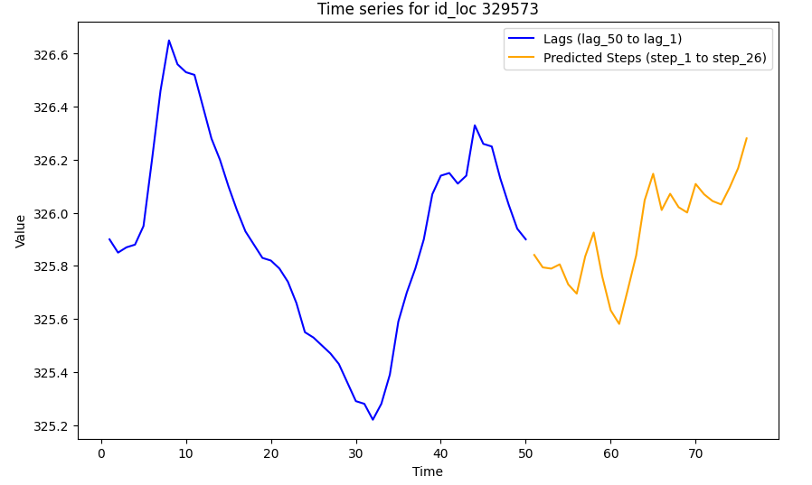
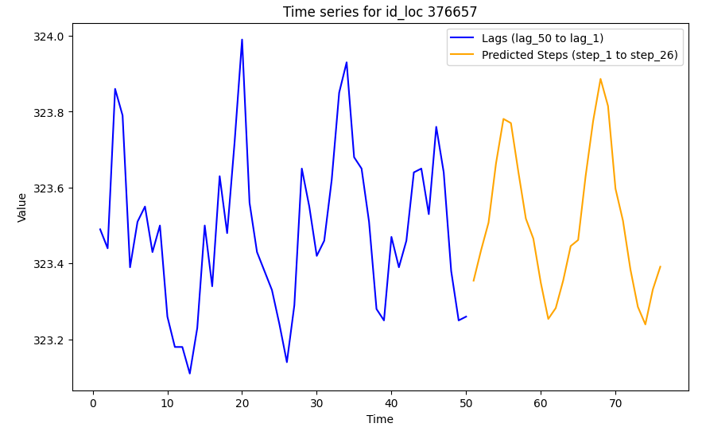

# AI for Life Sciences Hackathon (2nd Edition) - Task 1 Solution

## Overview

This repository contains my porposed solution for **Task 1** of the **AI for Life Sciences (AI4LS) Hackathon - Second Edition** and access to the code and documentation that generated the solution for **Task 2** through the folder `supplemental_material_for_task_2`. 

The first task involved forecasting groundwater levels for specific locations within Austria, covering the period from January 2022 to June 2024.

The repository includes various Jupyter notebooks documenting the entire process: from data processing and integration, to the selection of exogenous variables and model evaluation. Additionally, we have created a script specifically focused on the final training and prediction process, which we introduce before diving into the notebooks, for those who want a quickstart.

In this `README.md`, we first explain how to train the model for a single location and make the corresponding predictions. Afterward, we explain the methodology used to solve the challenges, while providing a brief summary of the content of each notebook that makes up the project.


## Table of Contents

0. [How to Run](#how-to-run)
1. [Preliminary Remarks](#preliminary-remarks)
2. [Data Processing and Cleaning](#data-processing-and-cleaning)
4. [Exogenous Variables Integration](#exogenous-variables-integration)
5. [Model and Exogenous Variables Selection](#model-and-exogenous-variables-selection)
6. [Re-training and Final Predictions](#re-training-and-final-predictions)
7. [Results](#results)

## How to Run

1. Clone this repository:
   ```bash
   git clone https://github.com/samueldepaul/AI4LS-2_Hackathon.git
   ```
   (or just download and extract the zip file clicking on `Code`)

2. Navigate to the local repository directory:
   `.../.../AI4LS-2_Hackathon`

3. Install the required libraries:
   (Recommended: Create a dedicated enviroment, for example using Anaconda `conda create --name YOUR-ENV-NAME python=3.10.14`)
   ```bash
   pip install -r requirements.txt
   
4. Download the training dataset:
   
   Since the file is quite big (680MB) we weren't able to upload it to GitHub. Download the file using the following Google Drive link and place it in the `auxiliary_data` folder: https://drive.google.com/file/d/1XdebJNdb9qdjF7JMyXYCMNi1-umvrHfj/view?usp=sharing

5. Run the script:
   ```bash
   python train_predict.py <id_loc>
   ```
   (Replace the placeholder by the id of the location you desire to obtain predictions for)

**Example execution:**
```bash
>python train_and_predict_gw.py 309021

Loading datasets...

Starting the process for id_loc 309021...

Preparing data for id_loc 309021...

Training model xgboost for id_loc 309021...

Starting cross-validation training for xgboost...

Training completed for xgboost

Generating predictions for id_loc 309021...

The predictions for the next 26 steps (Jan 2022 - Jun 2024) are:

[226.52112 226.53053 226.70256 226.75009 226.87419 226.97194 226.56784 226.42398 226.46431 226.5989
 226.51512 226.59172 226.5986  226.639 226.60005 226.83292 226.83516 227.03792 226.79814 226.54314
 226.54156 226.398 226.41527 226.49992 226.51083 226.6074]

 Process completed for id_loc 309021.  
```

## Preliminary Remarks
- I've chosen to present the code using Jupyter notebooks because I believe that, especially for a competition setting, it offers a more visual, clear, and readable format. Notebooks allow for a step-by-step demonstration of the code, which helps to easily track the thought process behind each decision, and makes the methodology more transparent and easier to follow.

## Data Processing and Cleaning

**Notebook**: `Data_Processing_and_Cleaning.ipynb`

In this notebook, the initial data processing pipeline is implemented, followed by an exploratory data analysis (EDA) to better understand the structure and distribution of the dataset. Some intermediate files are saved to avoid reprocessing long-running computations.

- **Groundwater Level Time Series**: Historical time series of groundwater levels from March 1930 to December 2021 are retrieved for each location from the [Austria groundwater data](https://ehyd.gv.at/).
- **Dataframe Construction**: The notebook consolidates groundwater data from multiple CSV files, extracts geographical information (coordinates, terrain elevation, etc.), and merges the data into a single DataFrame for further analysis.
- **Dataset Preparation**: The dataset is transformed (windowed) to include `lag` features (past observations) and `step` features (future values to predict).
- **Feature Engineering**: Temporal features and historical aggregates are generated, ensuring no data leakage.
- **Data Reduction**: Since exogenous data prior to 1960 is hard to find, observations before 1960 are discarded, reducing the dataset by only 1%.

## Exogenous Variables Integration

**Notebook**: `Exogenous_Variables_Integration.ipynb`

This notebook integrates exogenous variables into the dataset to enrich the input features for machine learning model training. 

- **Climate-related Variables**: Exogenous variables related to climate are merged into the dataset.
- **Additional Exogenous Variables**: Variables related to soil, land cover, population, and distance to the nearest city are iteratively integrated. These variables are stored in files with a similar structure, facilitating the merging process.

## Model and Exogenous Variables Selection

**Notebook**: `Model_Exogenous_Variable_Selection.ipynb`

This notebook focuses on model training and the selection of exogenous variables.

- **Variable Classification**: Variables are categorized into essential variables (past lags and future steps), temporal variables, climatological variables, and more.
- **Exploratory Modeling**: Various models, including tree-based methods (XGBoost, CatBoost, LightGBM) and classical models (Ridge, ElasticNet), are fitted using Randomized Search and Cross Validation to find the best combination of variables and hyperparameters.
- **Performance Analysis**: The notebook evaluates model performance using blind test data.

<p align="center">
  
  
</p>

|                           |                                                                                                   | Mean SMAPE | SMAPE Std. Dev. | SMPAE Q1 | SMAPE Q2 | SMAPE Q3 |
|---------------------------|---------------------------------------------------------------------------------------------------|------------|-----------------|----------|----------|----------|
|    Baseline Predictions   | Baseline 1 (Constant previous month)                                                              |   0.1725   |      0.1643     |  0.0702  |  0.1244  |  0.2182  |
|                           | Baseline 2 (Constant average last 4y)                                                             |   0.1651   |      0.1614     |  0.0661  |  0.1174  |  0.2137  |
|                           | Baseline 3 (Value 2y ago)                                                                         |   0.1859   |      0.1719     |  0.0759  |  0.1386  |  0.2401  |
|                           | Baseline 4 (Average of lags 24, 36 and 48)                                                        |   0.1700   |      0.1656     |  0.0674  |  0.1219  |  0.2189  |
| Trained model Predictions | Lags only                                                                                         |   0.0898   |      0.0655     |  0.0464  |  0.0732  |  0.1173  |
|                           | Lags +  Hisoric aggregates                                                                        |   0.0766   |      0.0556     |  0.0408  |  0.0623  |  0.0994  |
|                           | Lags +  Historic aggregates + Geographical and climate variables                                  |   0.0786   |      0.0568     |  0.0424  |  0.0647  |  0.1023  |
|                           | Lags + Historic aggregates + Geographical and climate variables +  Soil and demographic variables |   0.0759   |      0.0550     |  0.0413  |  0.0609  |  0.0986  |
|                           | Combined                                                                                          |   0.0751   |      0.0548     |  0.0406  |  0.0608  |   0.978  | 

*Metrics calculated on a generated blind test.


- It was observed that models with the largest feature sets perform the best for many locations, but no clear variable set emerged as consistently superior.
- **Combined Approach**: Based on performance, a combined approach is adopted: each location is predicted using the model, hyperparameters and set of features that perform best for that location.

## Re-training and Final Predictions

**Notebook**: `Re-train_and_Make_Predictions.ipynb`

This final notebook re-trains the models with the best-performing hyperparameters and makes predictions for each location. 

- **Best Models and Hyperparameters**: The best models and their configurations are loaded from a JSON file. 
- **Final Predictions**: The code pipeline handles memory constraints and dynamically selects the best model for each location, making predictions that are uploaded to the Taikai platform.

## Results
We cannot directly compare the results from the final models, but we can visualize how they look in relation to the rest of the time series:

<p align="center">
  
  
</p>
<p align="center">
  
  
</p>

We don't know how accurate they will be, but they certainly look promising!
